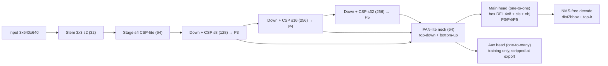

# Edge Vision Model (EVM-nano)

A **from-scratch, single-stage, NMS-free object detector** in pure PyTorch, designed for
**CPU edge deployment**. No Ultralytics, no AGPL code — every component (backbone, neck,
dual-assignment head, matchers, losses, evaluators, export, benchmarks) is implemented
in this repo.

- **Params**: ~2.4M total / ~2.2M deployable (aux training branch excluded)
- **Compute**: ~5.6 GMac @ 640×640 (≈11 GFLOPs MACs-based)
- **Inference**: NMS-free — one-to-one label assignment at train time → argmax decode at deploy
- **Path**: Pascal VOC (fast iteration) → COCO (honest benchmark) → ONNX → CPU runtimes

> Status: code complete and unit-tested. Training runs execute in Colab — see
> `Colab_Notebook.ipynb`. Measured numbers below are filled in by the
> notebook outputs after runs complete.

## Architecture



### Key design points
- **Dual assignment (YOLOv10-style, implemented from scratch)**: an auxiliary
  one-to-many branch densifies gradients during training; the main head is supervised
  with strict **one-to-one Hungarian assignment** (greedy mutual-exclusion on a
  task-aligned cost), so each object owns exactly one anchor → **no NMS needed**.
- **CPU-friendly ops only**: plain 3×3/1×1 convs, SiLU, nearest-neighbor FPN.
  No attention, no deformable convs, no dynamic ops.
- **Losses** (`losses/`): CIoU + DFL + BCE cls (IoU-aware soft targets) + BCE objectness.
- **Anchor-free DFL decode**: box = per-side softmax distribution over 8 bins.

## Repository layout
```
models/    backbone, PAN neck, dual-assignment head, decode, evm builder
losses/    task-aligned matcher (o2m top-k + o2o Hungarian), detection loss
data/      VOC/COCO datasets, mosaic/affine/HSV aug, downloaders
engine/    trainer (warmup+cosine, AMP, EMA, resume), VOC mAP (from scratch), inference
export/    ONNX export (aux stripped), host-side decode, ORT INT8 QDQ
benchmarks/ ORT/OpenVINO/NCNN latency bench, webcam demo
configs/   model_nano.yaml, voc.yaml, coco.yaml
scripts/   overfit_test, train, eval, flops, sanity_model
Colab_Notebook.ipynb / Generic_Notebook.ipynb (repo root)
tests/     matcher/loss/data/engine unit tests (all pass)
docs/      one-page write-up (what broke, what we learned, why NMS-free)
```

## Quick start
```bash
pip install torch torchvision pyyaml opencv-python-headless   # + deps per extras
python -m scripts.flops                                        # params + GMac
python -m data.download voc                                    # Pascal VOC
python -m scripts.overfit_test --root ./datasets/VOC           # 20-image sanity gate
python -m scripts.train --dataset voc --root ./datasets/VOC --device cuda
python -m scripts.eval  --dataset voc --root ./datasets/VOC --weights runs/voc/best.pt
# export + bench
python -m export.onnx_export --weights runs/voc/best.pt --num-classes 20
python -m benchmarks.bench_runtime --onnx runs/export/evm_nano.onnx --int8 --openvino
```

## Success criteria & results

| Metric | Target | Measured |
|---|---|---|
| Overfit-20 VOC mAP@0.5 | ≥ 0.90 | _pending notebook run_ |
| VOC2007 test mAP@0.5 | 0.70–0.75 | _pending_ |
| COCO val mAP | 0.35–0.40 | _pending_ |
| Params (deployable) | ~2.4M | **2.22M** |
| Compute @640 | ~5 GFLOPs | **5.6 GMac** |
| CPU latency (ORT) | ≤ 40 ms | _pending_ |
| INT8 speedup / mAP drop | 1.5–2× / <2 pts | _pending_ |

**Baseline for honest comparison**: YOLO26n reports **40.9 mAP** on COCO
(third-party reported number, not reproduced here).

## Latency vs mAP (runtime × precision)

| Runtime | Precision | mean ms | p95 ms | FPS | mAP |
|---|---|---|---|---|---|
| ONNX Runtime | FP32 | _pending_ | _pending_ | _pending_ | _pending_ |
| ONNX Runtime | FP16 | _pending_ | _pending_ | _pending_ | _pending_ |
| ONNX Runtime | INT8 | _pending_ | _pending_ | _pending_ | _pending_ |
| OpenVINO | FP32 | _pending_ | _pending_ | _pending_ | _pending_ |
| NCNN (ARM) | FP16 | _pending_ | _pending_ | _pending_ | _pending_ |

## Training curves

_VOC curve: `voc_curve.png` — generated by notebook 01 §7_
_COCO curve: `coco_curve.png` — generated by notebook 01 §7_

## Architecture diagram

See the mermaid diagram above (renders on GitHub). The deploy-time graph is
backbone → PAN neck → per-level (box DFL logits, cls logits, objectness) with decode
done host-side; the aux branch exists only during training.

## Datasets & licensing notes
- Pascal VOC 2007/2012 (annotations CC BY 2.5), COCO 2017 (annotations CC BY 4.0) —
  downloaded at runtime, not committed.
- Annotation tooling for custom data: CVAT (Apache-2.0) or labelImg (MIT).
- This project ships **no LICENSE file yet**; all source code in this repo is original.